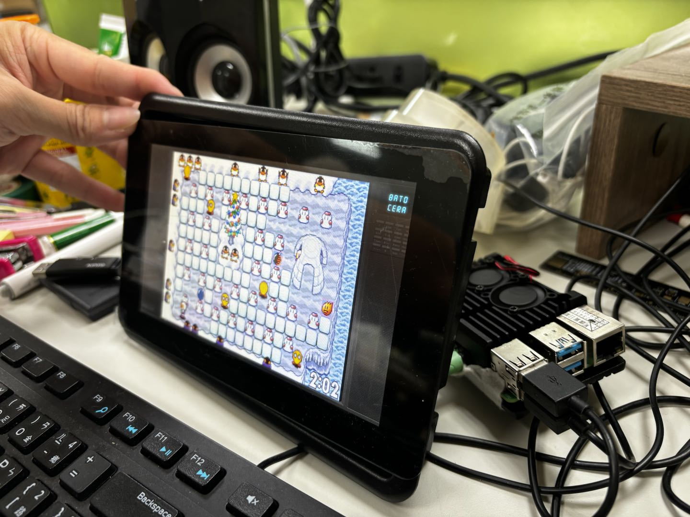

# raspberry-pi-4 [batocera]

## reference 
* raspberry pi 4 image upload: https://www.youtube.com/watch?v=AtlLyEYuaLE
* raspberry pi imager: https://wiki.batocera.org/install_batocera
* game img source: https://www.reddit.com/r/SBCGaming/comments/g9gi27/retro_gaming_base_images_for_raspberry_pi_4/
  * recalbox: from pi imager
  * retropie: from pi imager
  * batocera img: https://batocera.org/download
  * flameMonkabuntu: https://www.reddit.com/r/SBCGaming/comments/j4p1zh/flamemonkabuntu_20_for_raspberry_pi_4_by/
  * monkapie: https://www.reddit.com/r/SBCGaming/comments/dg4cqw/unofficial_retropie_buster_pi4_monkapie_v13_by/?utm_source=share&utm_medium=ios_app&utm_name=iossmf
  

